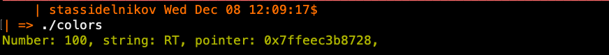

# Статические библиотеки и с чем их едят

## Введение

Если ты, друг мой, написал красивый логгер и регулярно копируешь его из
одного проекта в другой, не зная, как каким-то образом сделать его 
глобально доступным для всего проекта, то эта статья - твой помощник.

### Примечания

* Весь код и команды ниже исполнены на MacOS Big Sur 11.4. Пути, указанные
в некоторых местах в коде должны, в теории, работать на любых unix-подобных
системах, возможно, за некоторыми исключениями. Статье будет пополняться по
мере тестирования.

* Да, я знаю еще кучу способов сделать это счастье через переменные
окружения, ключи компилятора и тд. Данная статья раскрывает лишь один
из них, не стесняйтесь контрибьютить via pull requests в добавление/исправление
представленного контента.


## Объектные файлы

Статическими библиотеками называют *скомпилированный объектный файл*.
Они включает в себя функции и переменные, преобразованные в объектный код.
Например, вы сталкивались с чем-то похожим при обычной компиляции вашего
source кода:


``gcc -c program.c -o program.o``

Флаг `-c` говорит компилятору взять отдельный файл и скомпилировать его
до объектного кода. Такой файл ***не будет исполняемым***, его нельзя 
запустить как обычную программу, так как компилятор не дошел до стадии
*линковки* файлов и линкер не завершил свою работу. О линкере можно
писать долго, но следует понимать работу так: после компиляции файлов
в объектники их нужно 'слинковать', проставляя в нужные места адреса 
функций, по которым должна прыгать программа.

В данной статье будем рассматривать все шаги на примере небольшой
библиотеке цветов, состоящей из трех файлов: colors.h и colors.c

> `colors.h`
 
```c
#pragma once

#define RED     "\x1b[31m"
#define GREEN   "\x1b[32m"
#define YELLOW  "\x1b[33m"
#define BLUE    "\x1b[34m"
#define MAGENTA "\x1b[35m"
#define CYAN    "\x1b[36m"
#define RESET   "\x1b[0m"

#define MAXLEN 1024

void set_color(const char* color);

void reset_color();

void print_color(const char* color, const char* fmt, ...);
```


> `colors.с`

```c
#include <stdio.h>
#include <stdarg.h>

#include "colors.h"


void set_color(const char* color) {
    printf("%s", color);
}

void reset_color() {
    printf("%s", RESET);
}

void print_color(const char* color, const char* fmt, ...) {

    va_list args;
    char output[MAXLEN] = {0};

    va_start(args, fmt);

    vsnprintf(output, MAXLEN, fmt, args);
    va_end(args);

    printf("%s%s", color, output);
}

```

> `main.с`

```c

#include <stdio.h>
#include "colors.h"

int main() {

    int a = 0;

    print_color(YELLOW, "Number: %d, string: %s, pointer: %p,\n", 100, "RT", &a);

    return 0;
}

```

Для начала скомпилируем файл colors.c до объектника

`` gcc -c colors.c -o colors.o ``

Файл скомпилировался, хотя в нем нет функции main, она не нужна, так 
как этот объектный файл - лишь деталь нашей программы, которую мы в
нужном месте вставим

Посмотрим, какие функции появились в нем с помощью `nm`:

``nm colors.o``

```
U ___stack_chk_fail
                 U ___stack_chk_guard
                 U ___vsnprintf_chk
                 U _memset
0000000000000050 T _print_color
                 U _printf
0000000000000030 T _reset_color
0000000000000000 T _set_color

```

Достаточно заметить, что функции `print_color`, `reset_color` и `set_color`
дейстительно лежат там. Теперь данный объектный файл, теоретически, можно
подключить к любому проекту, где есть main и для него будут доступны функции,
которые мы тут скомпилировали. Однако, отметим следующие проблемы:

* Объектный файлов может быть много, подключать каждый - неприятно и неудобно
* Объектные файлы должны быть в той же директории, где ваш проект, либо 
надо указывать путь к директории, где они лежат, при компиляции
* Аналогично с хедер файлом, который нужен нам для непосредственного
доступа к именам функций

## Создание статической библиотеки

Для решения первой проблемы, создадим из объектного файла непосредственно
*статическую библиотеку*.

``ar -rc libcolors.a colors.o ``

Очень важно, чтобы статические билиотеки оканчивались на .a и имели 
префикс lib.

Команда `ar` по сути архивирует поданные ей объектные файлы в .a файл.
Данный архивированный файл мы будем подключать к нашим проектам, чтобы
получать доступ к функциям из объектников, которые там были скомпилированы.

Мы решили проблему с большим количеством файлом путем создания библиотеки.

```bash
-rwxr-xr-x  1 stassidelnikov  staff    49K Dec  5 09:55 colors
-rw-r--r--  1 stassidelnikov  staff   411B Dec  5 09:55 colors.c
-rw-r--r--  1 stassidelnikov  staff   340B Dec  5 09:55 colors.h
-rw-r--r--  1 stassidelnikov  staff   1.8K Dec  5 11:36 colors.o
-rw-r--r--  1 stassidelnikov  staff   2.0K Dec  5 11:49 libcolors.a
-rw-r--r--  1 stassidelnikov  staff   169B Dec  5 09:50 main.c
-rw-r--r--  1 stassidelnikov  staff   4.8K Dec  5 11:46 static-libs.md
```

Теперь можно запустить наш main.c следующим образом

``gcc -L. -lcolors main.c ``

Флаг ``-L.`` говорит линкеру искать билиотеку libcolors.a в ***текущей директории***
(символ .). Префикс lib и расширения .a автоматически обрабатываются линкером
при поиске этой билиотеки, вам надо указать лишь то, что между ними
(в данном случае colors).

## Системные пути

Мы еще не решили проблему с путем. Можно, конечно, указать линкеру путь, где будут лежать
ваши статические библиотеки, но есть способ не расписывать все эти пути,
а положить статические либы в системные пути.

* Примечание: под линуксом при ошибке выполнения какой-либо команды ниже,
выполните ее через sudo в режиме суперпользователя.


### Заголовочные файлы

`gcc` ищет подключаемые библиотеки, заголовочные файлы 
и тому подобное в специфицированных документациях директориях.

Согласно документации, первым делом gcc ищет хедера в `/usr/include/sys`
На MacOS в принципе такой директории по дефолту нет, путем тестирования
и чтения документации можно узнать, что достаточно скопировать хедер в 
`/usr/include/local`.

На линуксе работает вариант с копированием в `/usr/local/include`

Добавив туда свой заголовочный файл, мы сможем подключать его с помощью
фигурных скобок в любой проект:

`cp colors.h /usr/include/local`

> `main.с`

```c

#include <stdio.h>
#include <colors.h>

```

> `colors.с`

```c
#include <stdio.h>
#include <stdarg.h>

#include <colors.h>
```

Теперь в обоих файлах можно заменить скобки на угловые, и компилятор
успешно будет находить искомый файл.

### Библиотеки

Аналогично поступим с нашей библиотекой. Директория `usr/local/lib`
содержит в себе статические библиотеки. Собственно, это один из путей, 
которые компилятор выбирает для поиска библиотек по дефолту.

`cp libcolors.a /usr/local/lib/`

После этого можно удалить локальные объектые и сорс файлы кроме main.c:

```bash
-rw-r--r--  1 stassidelnikov  staff   169B Dec  5 12:23 main.c
-rw-r--r--  1 stassidelnikov  staff   9.1K Dec  5 12:23 static-libs.md

```

> `main.с`

```c

#include <stdio.h>
#include <colors.h>


int main() {

    int a = 0;

    print_color(YELLOW, "Number: %d, string: %s, pointer: %p,\n", 100, "RT", &a);

    return 0;
}

```

Компилируем программу без указания дополнительных путей:

``gcc -lcolors main.c -o colors``

Все работает:

<kbd>
    
</kbd>

